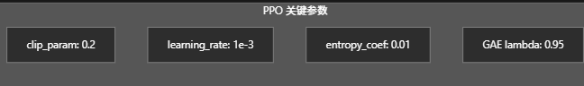

play.py
仿真当中展示训练的结果
python scripts/rsl_rl/play.py --task Isaac-Velocity-Marching-Unitree-G1-29Dof-v0 --checkpoint "e:\Aunitree\backup\logs\rsl_rl\unitree_g1_29dof_marching\2025-12-07_18-38-59\model_2500.pt" --num_envs 1

tensorboard --logdir "e:\Aunitree\backup\logs\rsl_rl\unitree_g1_29dof_marching\2025-12-07_18-38-59"

四个重要参数
clip_param: 0.2
learning_rate: 1e-3
entropy_coef: 0.01
GAE lambda: 0.95