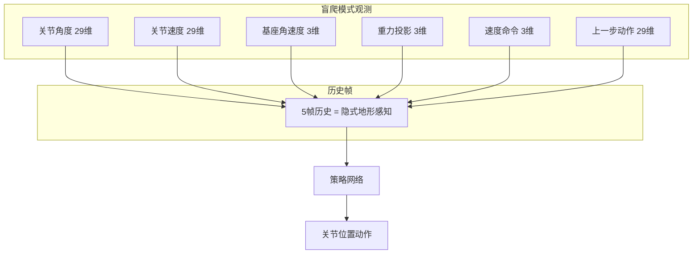
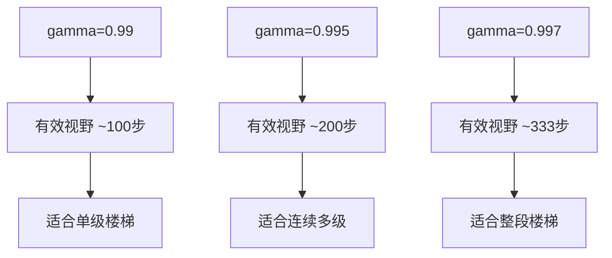
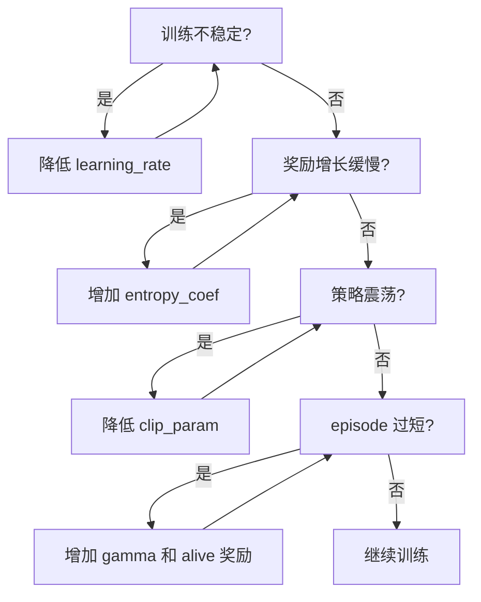

# 盲爬楼梯任务 PPO 参数调优计划

## 1. 任务背景与挑战

### 1.1 盲爬楼梯任务特点

盲爬楼梯（Blind Stair Climbing）是指机器人**不依赖地形传感器（height_scan）**，仅通过本体感知（proprioception）来完成楼梯攀爬的任务。



### 1.2 核心挑战

| 挑战 | 描述 | 对PPO的影响 |
|------|------|-------------|
| **信息不完整** | 无地形高度信息，需从触觉反馈推断 | 需要更长的轨迹和历史帧 |
| **动作序列复杂** | 上楼梯涉及抬腿-迈步-着地-重心转移 | 需要更大的网络容量 |
| **容错性要求高** | 允许踩偏但要能恢复 | 需要鼓励探索但避免策略崩溃 |
| **长期依赖** | 一步失误可能导致后续连锁失败 | 需要更高的折扣因子 gamma |
| **稀疏奖励** | 只有成功上一阶才获得显著奖励 | 需要精细的奖励塑造和课程学习 |

---

## 2. PPO 参数分阶段设计

### 2.1 三阶段训练策略


### 2.2 详细参数配置

#### 阶段1: 探索期（0-20000 iterations）

**目标**: 学习基本的楼梯攀爬动作模式

```python
@configclass
class StairBlindPPO_Phase1_Cfg(RslRlOnPolicyRunnerCfg):
    """
    阶段1: 探索期配置
    
    特点:
        - 高初始噪声，鼓励探索多种攀爬策略
        - 较低学习率，避免早期过拟合
        - 较长轨迹，捕获完整的攀爬动作序列
    """
    
    # ==================== 训练运行参数 ====================
    num_steps_per_env = 48          # 原24 -> 48：上一级楼梯约需40+步
    max_iterations = 20000          # 阶段1训练20000次迭代
    save_interval = 500             # 早期多保存，便于选择最佳检查点
    experiment_name = "g1_stair_blind_phase1"
    empirical_normalization = True  # 启用观测归一化，帮助稳定训练
    
    # ==================== 策略网络配置 ====================
    policy = RslRlPpoActorCriticCfg(
        init_noise_std=1.2,                    # 高初始噪声，鼓励探索
        actor_hidden_dims=[512, 256, 256, 128], # 增加网络深度
        critic_hidden_dims=[512, 256, 256, 128],
        activation="elu",
    )
    
    # ==================== PPO 算法参数 ====================
    algorithm = RslRlPpoAlgorithmCfg(
        value_loss_coef=1.0,
        use_clipped_value_loss=True,
        
        clip_param=0.25,          # 稍宽松的裁剪，允许较大策略更新
        entropy_coef=0.02,        # 高熵系数，鼓励探索
        
        num_learning_epochs=5,    # 标准训练轮数
        num_mini_batches=4,       # 标准batch大小
        learning_rate=5.0e-4,     # 中等学习率
        schedule="adaptive",
        
        gamma=0.99,               # 标准折扣因子
        lam=0.95,
        
        desired_kl=0.015,         # 稍宽松的KL约束
        max_grad_norm=1.0,
    )
```

#### 阶段2: 精炼期（20000-60000 iterations）

**目标**: 优化动作质量，提高成功率

```python
@configclass
class StairBlindPPO_Phase2_Cfg(RslRlOnPolicyRunnerCfg):
    """
    阶段2: 精炼期配置
    
    特点:
        - 降低探索噪声，专注于优化已学动作
        - 增加训练轮数，更充分利用数据
        - 提高折扣因子，重视长期回报
    """
    
    # ==================== 训练运行参数 ====================
    num_steps_per_env = 48
    max_iterations = 60000          # 累计60000次迭代
    save_interval = 200
    experiment_name = "g1_stair_blind_phase2"
    empirical_normalization = True
    resume = True                   # 从阶段1恢复
    load_run = "g1_stair_blind_phase1"
    load_checkpoint = "model_20000.pt"
    
    # ==================== 策略网络配置 ====================
    policy = RslRlPpoActorCriticCfg(
        init_noise_std=0.8,                    # 降低噪声
        actor_hidden_dims=[512, 256, 256, 128],
        critic_hidden_dims=[512, 256, 256, 128],
        activation="elu",
    )
    
    # ==================== PPO 算法参数 ====================
    algorithm = RslRlPpoAlgorithmCfg(
        value_loss_coef=1.0,
        use_clipped_value_loss=True,
        
        clip_param=0.18,          # 收紧裁剪
        entropy_coef=0.008,       # 降低熵系数
        
        num_learning_epochs=8,    # 增加训练轮数
        num_mini_batches=8,       # 增加batch数量
        learning_rate=3.0e-4,     # 降低学习率
        schedule="adaptive",
        
        gamma=0.995,              # 提高折扣因子，重视长期
        lam=0.95,
        
        desired_kl=0.01,          # 标准KL约束
        max_grad_norm=0.8,        # 收紧梯度裁剪
    )
```

#### 阶段3: 巩固期（60000+ iterations）

**目标**: 提高鲁棒性，确保在各种难度下稳定

```python
@configclass
class StairBlindPPO_Phase3_Cfg(RslRlOnPolicyRunnerCfg):
    """
    阶段3: 巩固期配置
    
    特点:
        - 最低探索噪声，专注于策略收敛
        - 最长轨迹，确保长期规划能力
        - 最严格的更新约束，保持策略稳定
    """
    
    # ==================== 训练运行参数 ====================
    num_steps_per_env = 64          # 更长轨迹
    max_iterations = 100000         # 累计100000次迭代
    save_interval = 100
    experiment_name = "g1_stair_blind_phase3"
    empirical_normalization = True
    resume = True
    load_run = "g1_stair_blind_phase2"
    load_checkpoint = "model_60000.pt"
    
    # ==================== 策略网络配置 ====================
    policy = RslRlPpoActorCriticCfg(
        init_noise_std=0.5,                    # 低噪声
        actor_hidden_dims=[512, 256, 256, 128],
        critic_hidden_dims=[512, 256, 256, 128],
        activation="elu",
    )
    
    # ==================== PPO 算法参数 ====================
    algorithm = RslRlPpoAlgorithmCfg(
        value_loss_coef=1.0,
        use_clipped_value_loss=True,
        
        clip_param=0.12,          # 最严格裁剪
        entropy_coef=0.003,       # 最低熵系数
        
        num_learning_epochs=10,   # 更多训练轮数
        num_mini_batches=8,
        learning_rate=1.0e-4,     # 低学习率
        schedule="adaptive",
        
        gamma=0.997,              # 最高折扣因子
        lam=0.95,
        
        desired_kl=0.006,         # 最严格KL约束
        max_grad_norm=0.5,        # 最严格梯度裁剪
    )
```

---

## 3. 参数调整逻辑详解

### 3.1 轨迹长度 num_steps_per_env


- **原值 24**：仅能覆盖约2/3的攀爬周期
- **建议值 48-64**：覆盖完整攀爬周期 + 后续动作
- **原因**：PPO需要完整的动作序列来正确估计优势函数

### 3.2 网络架构 hidden_dims

| 架构 | 参数量 | 适用场景 |
|------|--------|----------|
| [512, 256, 128] | ~200K | 平地行走 |
| [512, 256, 256, 128] | ~330K | 盲爬楼梯 |
| [512, 512, 256, 128] | ~460K | 复杂多模态任务 |

- **增加深度原因**：
  - 盲爬需要从历史观测中提取隐式地形信息
  - 更深网络能学习更复杂的时序模式

### 3.3 探索与利用平衡

```
init_noise_std × entropy_coef = 探索强度

阶段1: 1.2 × 0.02 = 0.024 (高探索)
阶段2: 0.8 × 0.008 = 0.0064 (中等)
阶段3: 0.5 × 0.003 = 0.0015 (低探索)
```

### 3.4 折扣因子 gamma 的影响



**有效视野公式**: `1 / (1 - gamma)`

---

## 4. 与环境配置的协同调整

### 4.1 PPO 参数与奖励权重的关系

| 奖励类型 | 建议权重调整 | PPO参数协同 |
|----------|--------------|-------------|
| track_lin_vel_xy | 1.0 | 标准 |
| upward_progress | 1.5 → 2.0 | 增加 gamma 重视长期 |
| alive | 0.15 → 0.3 | 增加 num_steps_per_env |
| flat_orientation_l2 | -5.0 | 增加 value_loss_coef |
| gait | 0.5 → 0.8 | 增加轨迹长度覆盖步态周期 |

### 4.2 PPO 参数与课程学习的配合

```python
# 课程学习配置中的参数
terrain_levels = CurrTerm(
    func=mdp.terrain_levels_climb,
    params={
        "height_weight": 2.0,
        "forward_weight": 1.0,
        "upgrade_threshold_ratio": 0.3,  # 与 gamma 配合
        "downgrade_threshold": 0.5,
    }
)

# PPO 建议：
# - 早期阶段使用较低 gamma(0.99)，快速学习简单地形
# - 后期阶段提高 gamma(0.997)，学习长距离攀爬
```

---

## 5. 一体化配置方案

基于以上分析，提供一个**推荐的单一配置**，适用于从头训练：

```python
@configclass
class StairBlindPPORunnerCfg(RslRlOnPolicyRunnerCfg):
    """
    盲爬楼梯 PPO 推荐配置
    
    融合三阶段精华，使用自适应学习率自动调节
    """
    
    # ==================== 训练运行参数 ====================
    num_steps_per_env = 48
    max_iterations = 80000
    save_interval = 200
    experiment_name = "g1_stair_blind"
    empirical_normalization = True
    
    # ==================== 策略网络配置 ====================
    policy = RslRlPpoActorCriticCfg(
        init_noise_std=1.0,
        actor_hidden_dims=[512, 256, 256, 128],
        critic_hidden_dims=[512, 256, 256, 128],
        activation="elu",
    )
    
    # ==================== PPO 算法参数 ====================
    algorithm = RslRlPpoAlgorithmCfg(
        value_loss_coef=1.0,
        use_clipped_value_loss=True,
        
        clip_param=0.18,
        entropy_coef=0.01,
        
        num_learning_epochs=8,
        num_mini_batches=8,
        learning_rate=5.0e-4,
        schedule="adaptive",    # 自适应学习率会根据KL散度自动调节
        
        gamma=0.995,
        lam=0.95,
        
        desired_kl=0.01,
        max_grad_norm=0.8,
    )
```

---

## 6. 参数调优检查清单

### 6.1 训练前检查

- [ ] 确认环境配置中的 history_length = 5
- [ ] 确认 episode_length_s >= 20.0（足够完成多级楼梯）
- [ ] 确认观测维度与网络输入匹配
- [ ] 确认课程学习已启用

### 6.2 训练中监控

| 指标 | 健康范围 | 异常处理 |
|------|----------|----------|
| mean_reward | 持续上升 | 若停滞，增加探索 |
| policy_loss | < 0.1 | 若过大，降低 learning_rate |
| value_loss | 随奖励增长而增长 | 若不匹配，检查 gamma |
| kl_divergence | ~desired_kl | 若过大，降低 clip_param |
| episode_length | 逐渐增加 | 若过短，增加 alive 奖励 |

### 6.3 调参决策树



---

## 7. 训练命令示例

### 7.1 基础训练

```bash
# 使用默认配置训练
python scripts/rsl_rl/train.py \
    --task Unitree-G1-29dof-Stair-Blind \
    --num_envs 4096 \
    --max_iterations 80000
```

### 7.2 从检查点恢复

```bash
# 从阶段1恢复到阶段2
python scripts/rsl_rl/train.py \
    --task Unitree-G1-29dof-Stair-Blind \
    --num_envs 4096 \
    --resume True \
    --load_run unitree_g1_29dof_stair_blind \
    --checkpoint model_20000.pt
```

### 7.3 从平地模型迁移

```bash
# 使用平地预训练模型初始化
python scripts/rsl_rl/train.py \
    --task Unitree-G1-29dof-Stair-Blind \
    --num_envs 4096 \
    --resume True \
    --load_run unitree_g1_29dof_velocity \
    --checkpoint model_best.pt
```

---

## 8. 总结

### 关键参数对比表

| 参数 | 原值 | 推荐值 | 调整幅度 |
|------|------|--------|----------|
| num_steps_per_env | 24 | **48** | +100% |
| max_iterations | 50000 | **80000** | +60% |
| init_noise_std | 1.0 | **1.0** | 不变 |
| actor_hidden_dims | [512,256,128] | **[512,256,256,128]** | +1层 |
| clip_param | 0.2 | **0.18** | -10% |
| entropy_coef | 0.01 | **0.01** | 不变 |
| num_learning_epochs | 5 | **8** | +60% |
| num_mini_batches | 4 | **8** | +100% |
| learning_rate | 1e-3 | **5e-4** | -50% |
| gamma | 0.99 | **0.995** | +0.5% |
| desired_kl | 0.01 | **0.01** | 不变 |
| max_grad_norm | 1.0 | **0.8** | -20% |

### 预期效果

1. **训练稳定性提升**：更保守的更新参数减少策略崩溃风险
2. **动作质量提升**：更长轨迹和更大网络能学习复杂动作序列
3. **长期规划能力**：更高的 gamma 使策略重视整段楼梯的完成
4. **收敛速度**：虽然单次迭代更慢，但总体收敛更稳定
